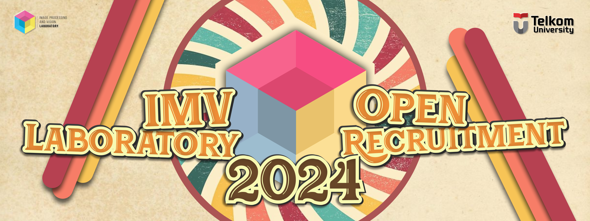

<h1 style=" text-align: center; font-weight: bold;">TEST CODING IMV 2024/2025</h1>



## ***PERATURAN TES CODING***

1. Tes coding dilakukan secara individu.
2. Dilarang bekerja sama, memberikan bantuan calon asisten lain, serta melakukan kecurangan dalam bentuk dan cara apapun. Jika terbukti melakukan kecurangan, calon asisten akan dikeluarkan dari proses rekruitasi.
3. Tidak diperkenankan keluar ruangan selama tes coding berlangsung.
4. File yang dibutuhkan selama Tes Coding IMV 2024/2025 dapat diakses pada folder `assets` pada repository github ini.
5. Calon asisten diperbolehkan membuka semua sumber seperti dokumentasi, forum, atau sumber lainnya di internet.
6. **Tidak diperkenankan menggunakan ***AI Tools*** dalam bentuk apapun.**
7. Waktu pengerjaan maksimal **100 menit**, bagi yang sudah selesai diperkenankan untuk tetap ditempat dan menunggu arahan dari asisten.
8. Calon asisten diperbolehkan minum selama tes coding berlangsung.
9. Tes coding harus dikumpulkan melalui Google Form yang dapat diakses melalui tautan berikut: **LINK PENGUMPULAN**
10. Berkas yang harus dikumpulkan adalah file `.py` atau `.ipynb` serta `screenshoot` hasil output setiap program sesuai dengan nomor soal. Berkas dikumpulkan dalam bentuk .rar atau .zip dengan format sebagai berikut: **NAMA_NIM.rar/NAMA_NIM.zip**.

**Strukur folder yang dikumpulkan**
```
    NAMA_NIM
    │
    ├── Nomor 1
    │   └── jawaban.txt
    │
    ├── Nomor 2
    │   ├── jawaban.py
    │   └── output.png
    │
    ├── Nomor 3
    │   ├── jawaban.ipnyb
    │   ├── output1.png
    │   └── output2.png
    │
    └── dst...
```

## ***SOAL TES CODING***

### ***Tes Potensi Akademik***

1. Harga sebuah GPU dan sebuah Webcam adalah `Rp5.500.000`. Jika harga GPU lebih besar `Rp5.000.000` dari harga Webcam. Berapakah harga dari masing-masing GPU dan Webcam? Jelaskan sesederhana mungkin!

### ***Tes Coding : Basic Python***

1. Tambahakan soal disini!


### ***Tes Coding : Image Processing***

1. Tambahakan soal disini!

### ***SOAL BONUS!***

1. Tambahakan soal disini!